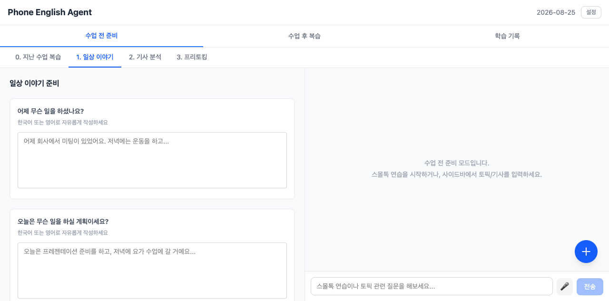
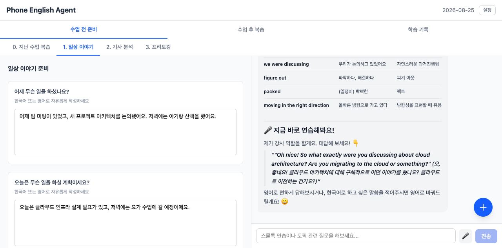
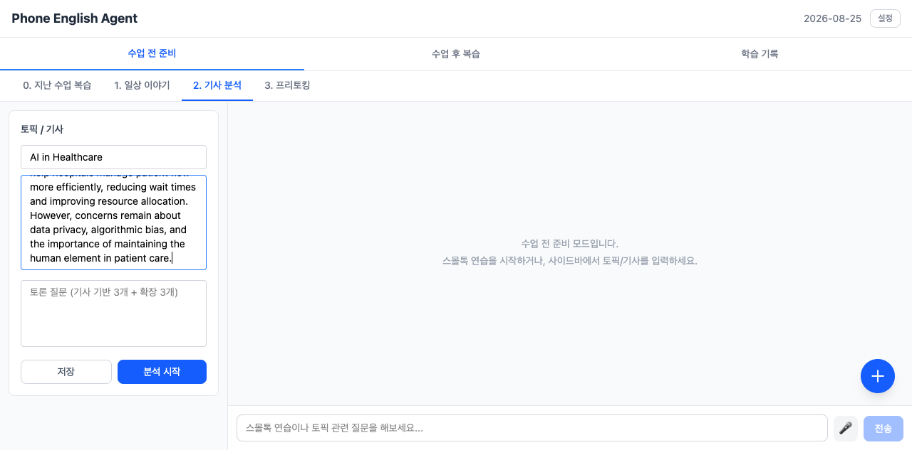
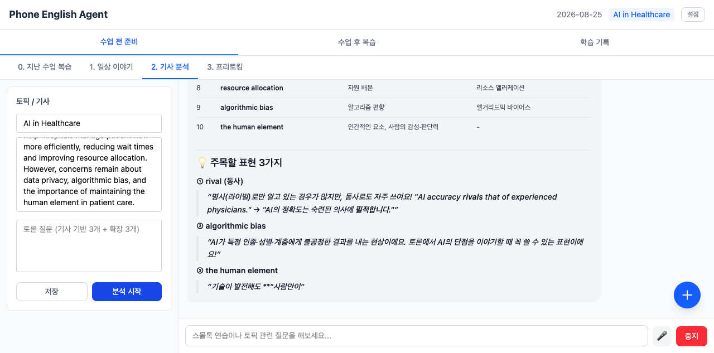
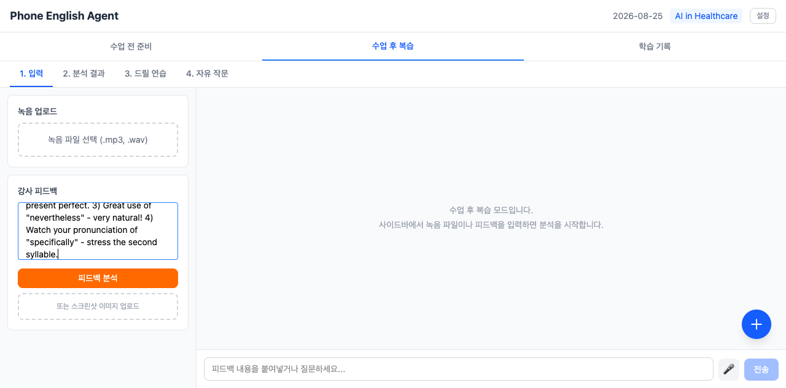
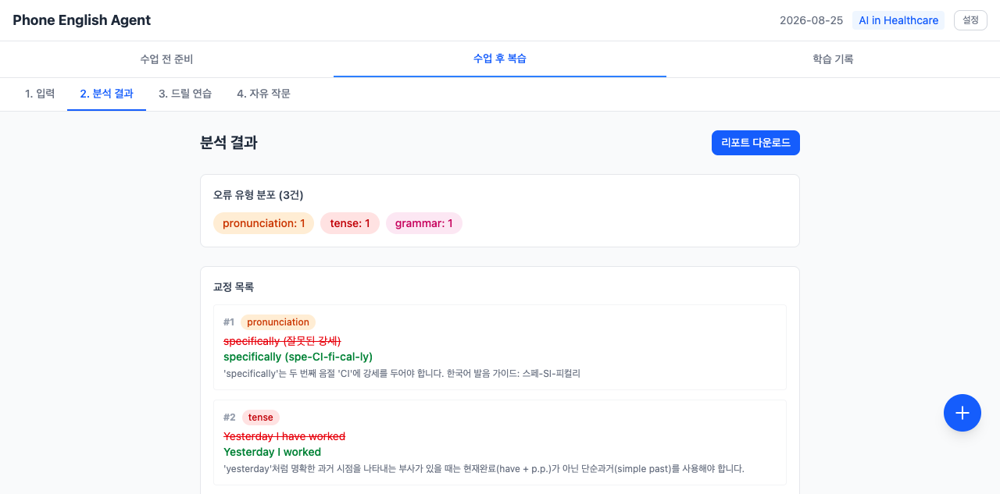
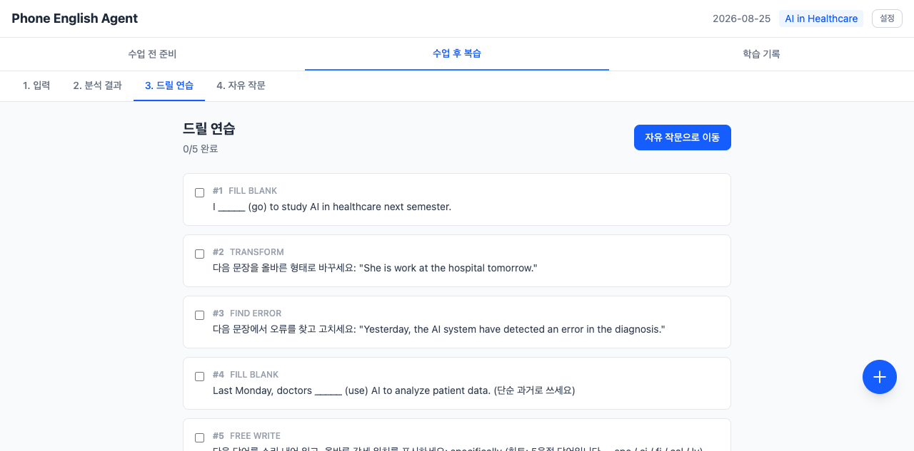
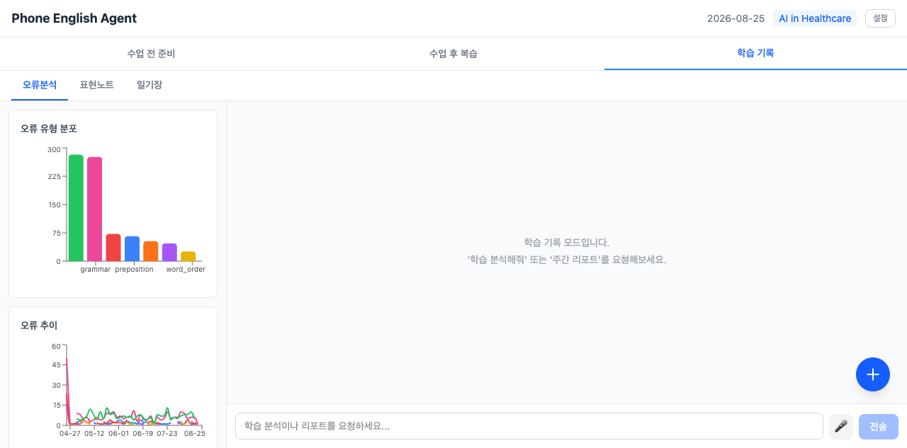
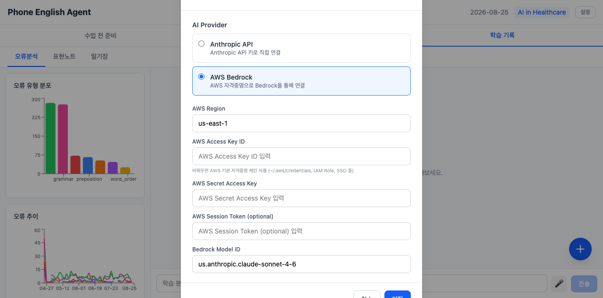

# Phone English Learning Agent v2

전화영어 수업 전후 30분을 AI로 코칭하는 AI Native 로컬 Mac 학습 도구.

## 왜 만들었나

전화영어 수업(20분)만으로는 영어 실력이 잘 늘지 않는다. 강사와 말만 하다 끝나고, 같은 실수를 반복하게 된다. 이 도구는 **수업 전 30분 준비**와 **수업 후 30분 복습**을 AI가 체계적으로 코칭하여 수업 효과를 극대화한다.

## 학습 흐름

```
[수업 전 30분]           [수업 20분]          [수업 후 30분]
┌──────────────┐      ┌──────────┐      ┌───────────────┐
│ 1. 스몰톡 연습  │      │          │      │ 1. 녹음/피드백   │
│    (10분)      │      │  전화영어  │      │    입력 (5분)   │
│ 2. 토픽 분석   │  →   │  수업     │  →   │ 2. 오류 첨삭    │
│    (10분)      │      │  진행     │      │    (10분)      │
│ 3. 토론 준비   │      │          │      │ 3. 드릴 연습    │
│    (10분)      │      │          │      │    (15분)      │
└──────────────┘      └──────────┘      └───────────────┘
```

---

## 스크린샷

### 수업 전 준비

**1. 일상 이야기 — 스몰톡 연습 준비**

어제/오늘 있었던 일을 한국어 또는 영어로 자유롭게 입력하면, AI가 자연스러운 영어 표현과 후속 질문으로 스몰톡 연습을 코칭한다.



---

**2. 스몰톡 AI 대화 — 실시간 코칭**

입력한 일상 내용을 바탕으로 AI 강사와 영어로 대화 연습. 핵심 표현 목록과 함께 후속 질문을 던지며 실제 수업처럼 연습할 수 있다.



---

**3. 기사 분석 — 토픽 & 스크립트 입력**

오늘 수업에서 다룰 뉴스 기사나 스크립트를 붙여넣으면 AI가 핵심 표현을 추출하고 토론 질문을 자동 생성한다.



---

**4. 기사 분석 — 핵심 표현 추출 결과**

AI가 기사에서 수업에 쓸 수 있는 표현을 선별하고, 각 표현의 의미·예문·발음 팁까지 한 번에 제공한다.



---

### 수업 후 복습

**5. 강사 피드백 입력**

수업 후 강사에게 받은 피드백을 텍스트로 붙여넣거나, 녹음 파일(.mp3/.wav)을 업로드하면 AI가 자동으로 전사 및 분석을 시작한다.



---

**6. 오류 분석 결과 — 교정 목록 & 유형 분포**

피드백에서 문법/시제/발음 등 오류를 자동 추출하고 유형별로 분류한다. 리포트 다운로드(.md) 기능도 제공한다.



---

**7. 드릴 연습 — 오류 기반 문제 자동 생성**

분석된 오류를 바탕으로 FILL BLANK / TRANSFORM / FIND ERROR / FREE WRITE 4가지 유형의 드릴 문제를 자동 생성. 체크박스로 완료를 추적한다.



---

### 학습 기록

**8. 오류 추이 & 수업 이력**

누적된 오류 데이터를 유형별 막대 차트와 시간 추이 선 그래프로 시각화. 수업 이력 목록과 표현 사전도 함께 관리된다.



---

**9. 설정 — AI 프로바이더 선택**

Anthropic API 직접 연결 또는 AWS Bedrock 중 선택 가능. AWS는 IAM Role/SSO 등 기본 자격증명 체인도 지원한다.



---

## 주요 기능

### 수업 전 준비 (4단계 플로우)
0. **지난 수업 복습** — 이전 드릴/표현 복기
1. **일상 이야기** — 요일 기반 스토리 입력(텍스트/음성) + Agent 스몰톡 연습
2. **기사 분석** — 토픽/기사/질문 입력 → 핵심 표현 추출 + PREP 코칭
3. **프리토킹** — 토론 질문 기반 자유 대화 연습

### 수업 후 복습 (4단계 플로우)
1. **입력** — 녹음 업로드 (mlx-whisper 전사) + 강사 피드백 입력 (텍스트/스크린샷)
2. **분석 결과** — 오류 유형 분포 + 교정 목록 + 마크다운 리포트 다운로드
3. **드릴 연습** — 오류 기반 문장 구조 드릴 (체크박스 완료 추적)
4. **자유 작문** — 배운 표현 활용 작문 + AI 교정

### 학습 기록
- 오류 유형별 빈도 차트, 시간별 추이 그래프
- AI 텍스트 리포트 (주간/월간 분석)
- 수업 이력 및 표현 사전

---

## 기술 스택

| 영역 | 기술 |
|------|------|
| Backend | Python + FastAPI + Anthropic SDK |
| Frontend | React 19 + TypeScript + Vite + Tailwind CSS 4 |
| AI | Claude API (대화, 분석, 도구 호출) |
| 음성 전사 | mlx-whisper (Apple Silicon 네이티브) |
| 이미지 텍스트 추출 | Claude Vision API |
| 차트 | Recharts |
| DB | SQLite |


## AI Agent 아키텍처

### Agentic Loop (Tool Use 패턴)

```
┌─────────────────────────────────────────────────────────────┐
│                    Agent Loop (SSE Stream)                  │
└─────────────────────────────────────────────────────────────┘
                              │
                              ▼
                    ┌──────────────────┐
                    │  User Message    │
                    └──────────────────┘
                              │
                              ▼
          ┌───────────────────────────────────────┐
          │ Claude API (messages.stream)          │
          │ - System Prompt (mode별 역할 지시)    │
          │ - Tools (mode별 가용 도구)             │
          │ - Conversation History                │
          └───────────────────────────────────────┘
                              │
                ┌─────────────┴─────────────┐
                │                           │
                ▼                           ▼
        ┌──────────────┐          ┌──────────────┐
        │  end_turn    │          │  tool_use    │
        │  (완료)       │          │  (도구 호출)  │
        └──────────────┘          └──────────────┘
                │                           │
                │                           ▼
                │                ┌──────────────────────┐
                │                │ Execute Tool         │
                │                │ - DB 저장            │
                │                │ - Whisper 전사       │
                │                │ - 데이터 조회         │
                │                └──────────────────────┘
                │                           │
                │                           ▼
                │                ┌──────────────────────┐
                │                │ tool_result 전달     │
                │                │ (user message)       │
                │                └──────────────────────┘
                │                           │
                │                           ▼
                │                   (다시 Claude 호출)
                │                           │
                └───────────────┬───────────┘
                                │
                                ▼
                        ┌──────────────┐
                        │ SSE Events   │
                        │ - text_delta │
                        │ - tool_start │
                        │ - tool_result│
                        │ - done       │
                        └──────────────┘
                                │
                                ▼
                          Frontend UI
```

### 모드별 Agent 역할

#### 1. **Prep Mode** — 수업 전 준비 코치

**역할**: 전화영어 강사 + 학습 코치

**워크플로우**:
1. **스몰톡 연습** — 한국어 입력 → 자연스러운 영어 변환 + 후속 질문
2. **토픽 분석** — 기사/스크립트 → 핵심 표현 추출 + PREP 패턴 코칭
3. **프리토킹** — 토론 질문 기반 자유 대화 + 실시간 교정

**사용 도구** (4개):
- `generate_smalltalk_scenario` — 스몰톡 시나리오 저장
- `polish_english` — 한국어→영어 변환 및 다듬기
- `analyze_script` — 기사에서 핵심 표현 추출
- `explain_expression` — 표현 상세 설명 (예문/발음)

#### 2. **Review Mode** — 수업 후 복습 분석가

**역할**: 오류 분석 + 드릴 생성

**워크플로우**:
1. 녹음 전사 또는 피드백 입력 받기
2. 오류 추출 및 유형 분류 (tense/preposition/article 등)
3. 각 오류당 드릴 문제 자동 생성
4. UI 패널에 결과 표시 (텍스트 응답 최소화)

**사용 도구** (5개):
- `transcribe_audio` — 녹음 파일 → 텍스트 (mlx-whisper)
- `extract_corrections` — 오류 추출 + 교정 + 유형 분류
- `generate_drill` — 오류 기반 드릴 생성 (fill_blank/transform/find_error/free_write)
- `evaluate_drill_answer` — 학습자 답변 평가 + 피드백
- `generate_quiz` — 복습 퀴즈 생성

#### 3. **Analytics Mode** — 학습 기록 분석가

**역할**: 데이터 분석 + 리포트 생성

**워크플로우**:
1. 누적 오류 패턴 분석 (주간/월간)
2. 반복 실수 식별
3. 맞춤 학습 추천

**사용 도구** (1개):
- `analyze_error_patterns` — 오류 통계 + 트렌드 분석

### 10개 AI 도구 (Tools)

| # | 도구 이름 | 역할 | 입력 | 출력 | 모드 |
|---|----------|------|------|------|------|
| 1 | `generate_smalltalk_scenario` | 스몰톡 시나리오 저장 | 요일 컨텍스트, 한국어 입력, 영어 출력, 핵심 표현 | DB 저장 완료 | prep |
| 2 | `polish_english` | 한국어/거친 영어 → 자연스러운 영어 | 원본, 다듬어진 영어, 핵심 표현, 대안 표현 | 다듬어진 결과 + DB 저장 | prep |
| 3 | `analyze_script` | 기사/스크립트에서 핵심 표현 추출 | 표현 목록 (expression, meaning, example) | 추출 개수 + DB 저장 | prep |
| 4 | `explain_expression` | 표현 상세 설명 | 표현, 의미, 영어 정의, 예문, 발음 팁 | 설명 + DB 저장 | prep |
| 5 | `transcribe_audio` | 녹음 → 텍스트 전사 | recording_id | 전사 텍스트 + DB 업데이트 | review |
| 6 | `extract_corrections` | 오류 추출 및 교정 | 교정 목록 (original, corrected, explanation, error_type) | 저장된 교정 ID 목록 | review |
| 7 | `generate_drill` | 오류 기반 드릴 생성 | 드릴 목록 (drill_type, question, correct_answer) | 저장된 드릴 ID 목록 | review |
| 8 | `evaluate_drill_answer` | 드릴 답변 평가 | drill_id, user_answer, is_correct, feedback | 평가 결과 + DB 업데이트 | review |
| 9 | `generate_quiz` | 복습 퀴즈 생성 | 퀴즈 목록 (question, answer, quiz_type) | 저장된 퀴즈 ID 목록 | review |
| 10 | `analyze_error_patterns` | 누적 오류 패턴 분석 | analysis_type (weekly/monthly/all) | 통계 + 패턴 데이터 | analytics |

### SSE (Server-Sent Events) 스트리밍

Agent 응답은 실시간으로 스트리밍됩니다:

```typescript
// Event Types
event: text_delta      // Claude 응답 텍스트 (한 글자씩)
data: "안녕하세요"

event: tool_start      // 도구 호출 시작
data: {"name": "extract_corrections"}

event: tool_result     // 도구 실행 결과
data: {"name": "extract_corrections", "result": {...}}

event: done            // 대화 완료
data: {"status": "complete"}
```

**장점**:
- ✅ 실시간 타이핑 효과 (자연스러운 대화)
- ✅ 도구 실행 상태 표시 (투명성)
- ✅ 긴 응답도 즉시 시작 (UX 개선)

### Conversation History 관리

- **Persistent**: 수업별 대화 히스토리 SQLite 저장
- **Validation**: tool_use/tool_result 페어링 검증 (API 에러 방지)
- **Context**: 각 모드마다 독립적인 대화 컨텍스트 유지

---

## 실행 방법

### 사전 준비

- macOS (Apple Silicon)
- Node.js 18+
- Python 3.11+
- [uv](https://docs.astral.sh/uv/) (Python 패키지 매니저)
- Anthropic API Key 또는 AWS Bedrock 접근 권한

### 1. 환경 변수 설정

```bash
cd backend
cp .env.example .env
# .env 파일에 ANTHROPIC_API_KEY 입력
```

### 2. 의존성 설치 (최초 1회)

```bash
# Backend
cd backend && uv venv && uv pip install python-dotenv fastapi uvicorn anthropic python-multipart pillow mlx-whisper

# Frontend
cd frontend && npm install
```

### 3. 실행

```bash
# 전체 실행 (background)
./run.sh start

# 상태 확인
./run.sh status

# 로그 확인
./run.sh logs            # backend + frontend
./run.sh logs backend    # backend only

# 개별 재기동
./run.sh restart backend
./run.sh restart frontend

# 전체 중지
./run.sh stop
```

로그는 `logs/backend.log`, `logs/frontend.log`에 누적됩니다.

Backend `http://localhost:8000` / Frontend `http://localhost:5173`

<details>
<summary>개별 수동 실행</summary>

```bash
# Backend
cd backend && .venv/bin/python main.py

# Frontend
cd frontend && npm run dev
```

</details>

---

## 데이터 백업 및 복구

### 자동 백업

앱 실행 중 **자동으로 백업**이 생성됩니다:
- **빈도**: 매시간 체크하여 하루 1회 자동 백업
- **보관**: 최근 7개 백업 파일 자동 유지 (오래된 파일 자동 삭제)
- **위치**: `backend/backups/phone_eng_YYYYMMDD_HHMMSS.db`
- **안전성**: SQLite `backup()` API 사용 (앱 실행 중에도 안전)

### 수동 백업

#### 방법 1: API 호출
```bash
curl -X POST http://localhost:8000/api/backup
# 응답: {"status": "created", "filename": "phone_eng_20260825_143022.db"}
```

#### 방법 2: 파일 복사
```bash
cp backend/data/phone_eng.db backend/backups/phone_eng_manual_$(date +%Y%m%d).db
```

### 백업 목록 확인

```bash
curl http://localhost:8000/api/backup
# 또는
ls -lh backend/backups/
```

### 데이터 복구

⚠️ **복구 전 자동으로 현재 상태가 백업됩니다** (`phone_eng_pre_restore_*.db`)

#### 방법 1: API 호출
```bash
# 1. 백업 목록 확인
curl http://localhost:8000/api/backup

# 2. 원하는 백업으로 복구
curl -X POST "http://localhost:8000/api/backup/restore?filename=phone_eng_20260825_120000.db"
```

#### 방법 2: 수동 복구 (앱 중지 후)
```bash
# 1. 앱 중지
./run.sh stop

# 2. 현재 DB 백업 (안전을 위해)
cp backend/data/phone_eng.db backend/data/phone_eng_$(date +%Y%m%d_%H%M%S).db.bak

# 3. 백업 파일로 복구
cp backend/backups/phone_eng_20260825_120000.db backend/data/phone_eng.db

# 4. 앱 재시작
./run.sh start
```

### 백업 파일 정리

```bash
# 오래된 백업 수동 삭제
rm backend/backups/phone_eng_202608*.db

# 또는 특정 날짜 이전 삭제 (예: 30일 이전)
find backend/backups -name "phone_eng_*.db" -mtime +30 -delete
```

---

## 프로젝트 구조

```
phone-eng-agent-v2/
├── .claude/                # 스티어링, 스펙, 구현 계획 (SSOT)
│   ├── CLAUDE.md           # 스티어링 문서
│   ├── specs/              # 기능 스펙
│   └── plans/              # 구현 계획
├── docs/
│   └── screenshots/        # README용 스크린샷
├── backend/
│   ├── app/
│   │   ├── agent/          # AI 에이전트 (루프, 프롬프트, 도구 10개)
│   │   ├── routes/         # API 엔드포인트 11개
│   │   ├── services/       # DB, Whisper, 이미지 파서
│   │   ├── config.py       # 환경변수 + 멀티 프로바이더
│   │   ├── ai_client.py    # Anthropic/Bedrock 클라이언트 팩토리
│   │   ├── database.py     # SQLite 스키마 (9개 테이블)
│   │   ├── models.py       # Pydantic 모델
│   │   └── main.py         # FastAPI 앱
│   ├── data/               # SQLite DB
│   ├── uploads/            # 녹음 파일
│   ├── reports/            # 리뷰 리포트 (md)
│   └── pyproject.toml
├── frontend/
│   ├── src/
│   │   ├── api/            # REST + SSE 클라이언트
│   │   ├── hooks/          # useChat, useLesson, useVoiceInput
│   │   ├── components/
│   │   │   ├── chat/       # 채팅 패널 (마크다운 렌더링)
│   │   │   ├── prep/       # 수업 전 준비 (3단계)
│   │   │   ├── review/     # 수업 후 복습 (4단계)
│   │   │   ├── analytics/  # 학습 기록
│   │   │   └── settings/   # 프로바이더 설정
│   │   └── types/
│   └── package.json
└── README.md
```
