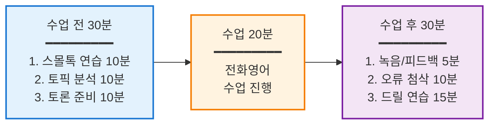
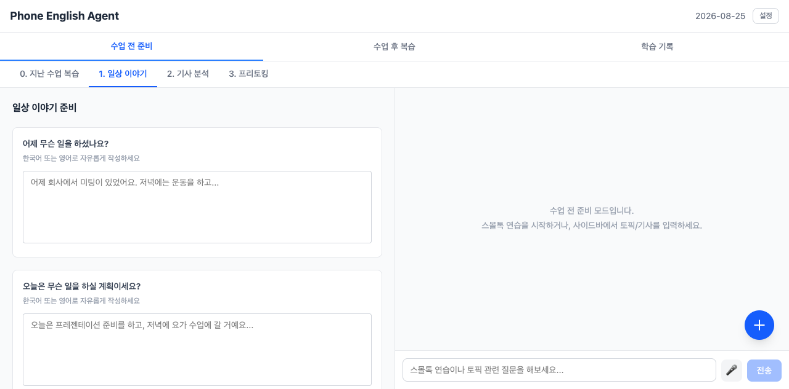
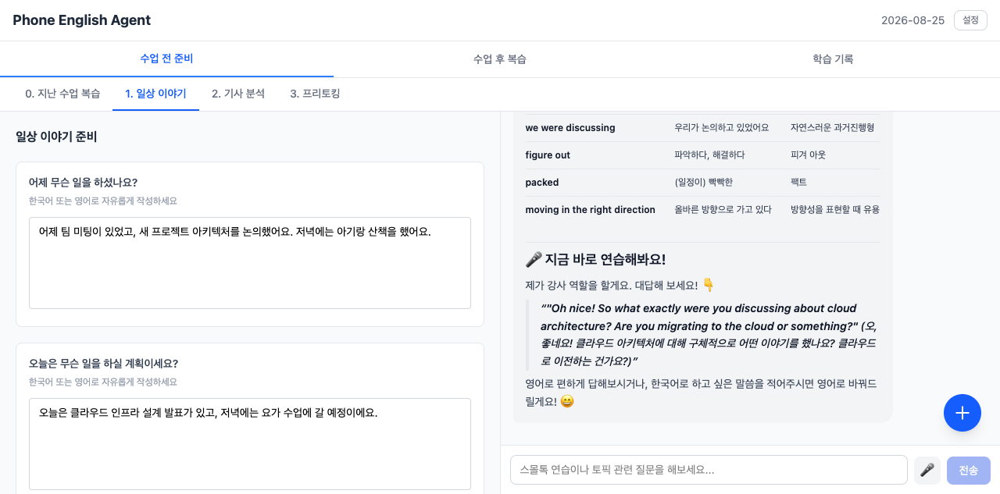
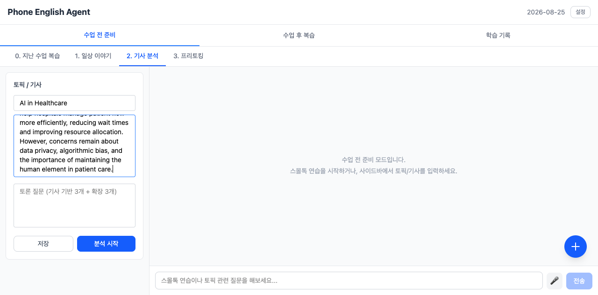
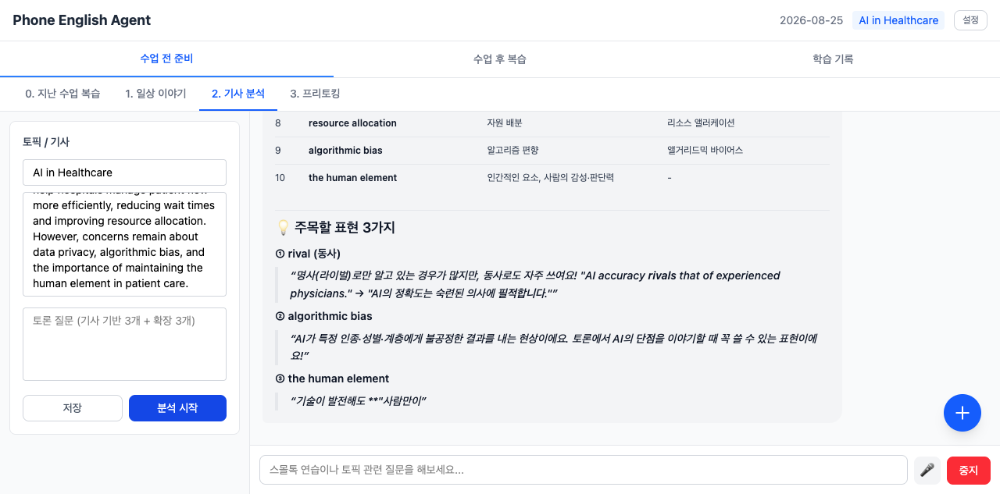
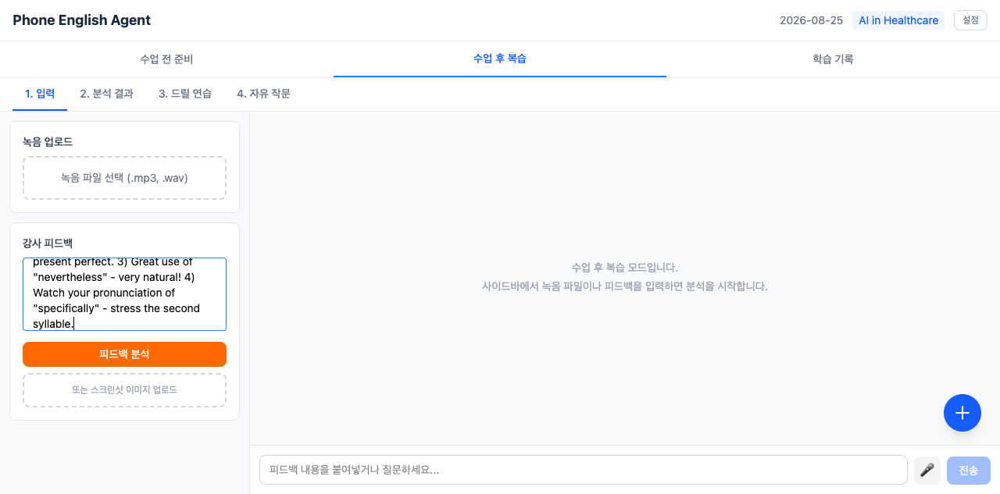
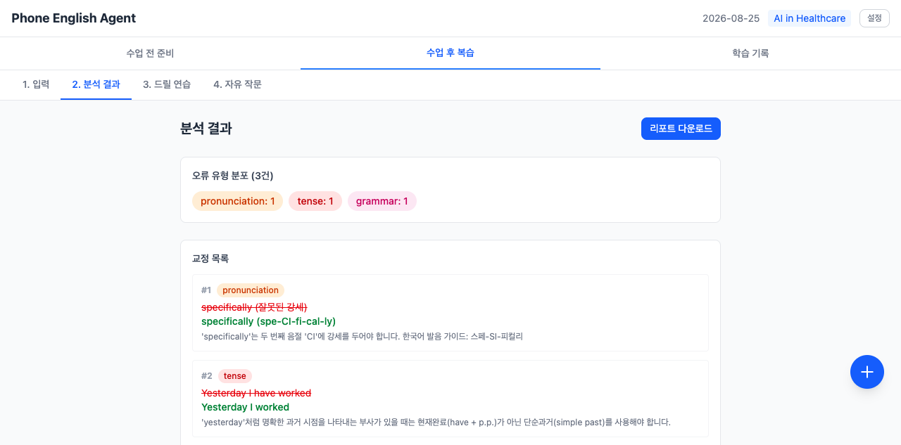
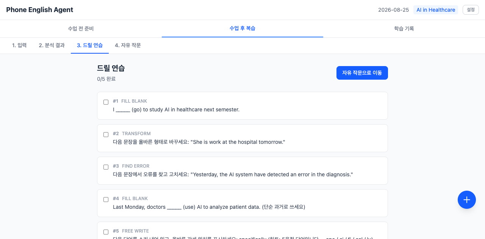
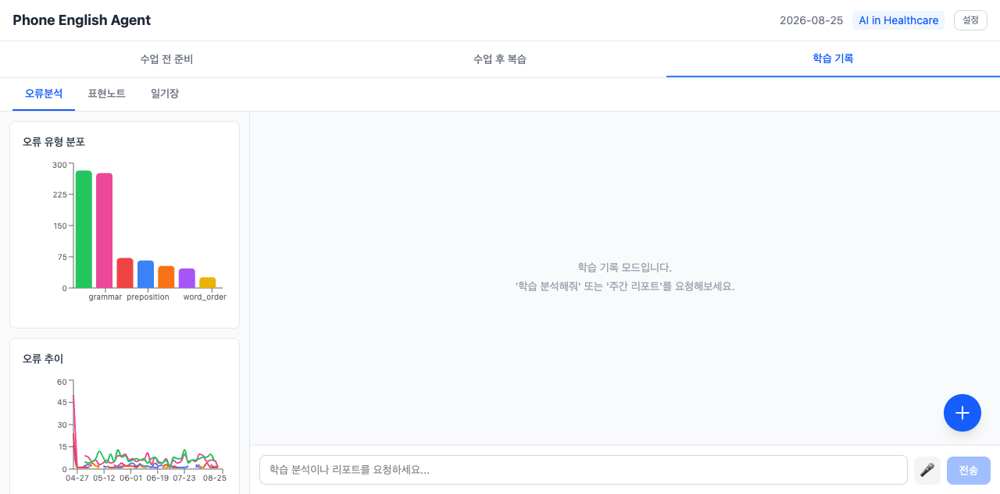
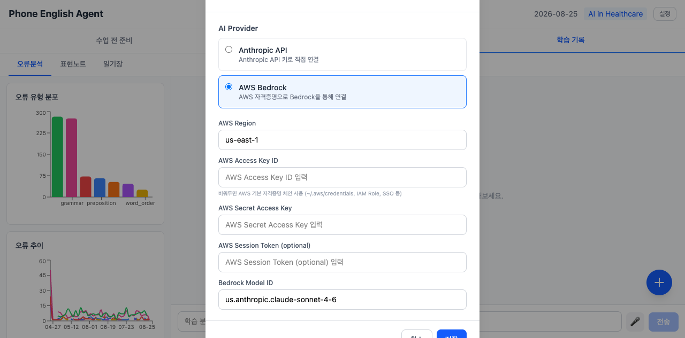

# Phone English Learning Agent v2

전화영어 수업 전후 30분을 AI로 코칭하는 AI 학습 Agent

## 프로젝트 목표

전화영어 수업(20분)만으로는 영어 실력의 향상이 더딜 수 있습니다. 강사와 말만 하다 끝나고, 같은 실수를 반복하게 되죠. 전화 영어 Agent 는 **수업 전 30분 준비**와 **수업 후 30분 복습**을 AI Agent 를 통해 쉽게 준비하고 복습할 수 있도록 도와드립니다.

## 학습 흐름


```mermaid
flowchart LR
    A[수업 전 30분<br/>━━━━━━━━━<br/>1. 스몰톡 연습 10분<br/>2. 토픽 분석 10분<br/>3. 토론 준비 10분] 
    --> B[수업 20분<br/>━━━━━━━━━<br/>전화영어<br/>수업 진행]
    --> C[수업 후 30분<br/>━━━━━━━━━<br/>1. 녹음/피드백 5분<br/>2. 오류 첨삭 10분<br/>3. 드릴 연습 15분]

    style A fill:#e3f2fd,stroke:#1976d2,stroke-width:2px
    style B fill:#fff3e0,stroke:#f57c00,stroke-width:2px
    style C fill:#f3e5f5,stroke:#7b1fa2,stroke-width:2px
```

---

## 스크린샷

### 수업 전 준비

**1. 일상 이야기 — 스몰톡 연습 준비**

어제/오늘 있었던 일을 한국어 또는 영어로 자유롭게 입력하면, AI가 자연스러운 영어 표현과 후속 질문으로 스몰톡 연습을 코칭합니다. 사용자의 일상 이야기는 프로파일로 저장되어 이후 스몰톡에서 사용자에 맞춘 대화를 진행하도록 합니다.



---

**2. 스몰톡 AI 대화 — 실시간 코칭**

입력한 일상 내용을 바탕으로 AI 강사와 영어로 대화 연습. 핵심 표현 목록과 함께 후속 질문을 던지며 실제 수업처럼 연습할 수 있습니다.



---

**3. 기사 분석 — 토픽 & 스크립트 입력**

오늘 수업에서 다룰 뉴스 기사나 스크립트를 붙여넣으면 AI가 핵심 표현을 추출하고 토론 질문을 자동 생성합니다.



---

**4. 기사 분석 — 핵심 표현 추출 결과**

AI가 기사에서 수업에 쓸 수 있는 표현을 선별하고, 각 표현의 의미·예문·발음 팁까지 한 번에 제공합니다.



---

### 수업 후 복습

**5. 강사 피드백 입력**

수업 후 녹음 파일(.mp3/.wav)을 업로드하면 AI가 자동으로 전사 및 분석을 시작합니다.



---

**6. 오류 분석 결과 — 교정 목록 & 유형 분포**

피드백에서 문법/시제/발음 등 오류를 자동 추출하고 유형별로 분류한다. 리포트 다운로드(.md) 기능도 제공합니다. 오류 유형과 데이터는 사용자별로 저장되어 다음 학습의 학습 준비 단계에서 사용자별 맞춤 교정의 데이터로 활용됩니다.



---

**7. 드릴 연습 — 오류 기반 문제 자동 생성**

교정에서 나아가 분석된 오류를 바탕으로 FILL BLANK / TRANSFORM / FIND ERROR / FREE WRITE 4가지 유형의 드릴 문제를 자동 생성하여 확실히 표현을 익힐 수 있도록 도와드립니다.



---

### 학습 기록

**8. 오류 추이 & 수업 이력**

누적된 오류 데이터를 유형별 막대 차트와 시간 추이 선 그래프로 시각화하고 수업 이력 목록과 표현 사전도 함께 관리합니다.



---

**9. 설정 — AI 프로바이더 선택**

Anthropic API 직접 연결 또는 AWS Bedrock 중 선택 가능. AWS는 IAM Role/SSO 등 기본 자격증명 체인도 지원합니다.



---


## 실행 방법

### 사전 준비

- macOS (Apple Silicon)
- Node.js 18+
- Python 3.11+
- [uv](https://docs.astral.sh/uv/) (Python 패키지 매니저)
- Anthropic API Key 또는 AWS Bedrock 접근 권한

### 1. 환경 변수 설정

```bash
cd backend
cp .env.example .env
# .env 파일에 ANTHROPIC_API_KEY 입력
```

### 2. 의존성 설치 (최초 1회)

```bash
# Backend
cd backend && uv venv && uv pip install python-dotenv fastapi uvicorn anthropic python-multipart pillow mlx-whisper

# Frontend
cd frontend && npm install
```

### 3. 실행

```bash
# 전체 실행 (background)
./run.sh start

# 상태 확인
./run.sh status

# 로그 확인
./run.sh logs            # backend + frontend
./run.sh logs backend    # backend only

# 개별 재기동
./run.sh restart backend
./run.sh restart frontend

# 전체 중지
./run.sh stop
```

로그는 `logs/backend.log`, `logs/frontend.log`에 누적됩니다.

Backend `http://localhost:8000` / Frontend `http://localhost:5173`

<details>
<summary>개별 수동 실행</summary>

```bash
# Backend
cd backend && .venv/bin/python main.py

# Frontend
cd frontend && npm run dev
```

</details>

---

## 모바일 접속 (Tailscale)

로컬에서 앱을 실행한 채로, 외부 네트워크의 스마트폰에서도 접속할 수 있습니다. Tailscale을 이용한 개인 VPN 방식이라 별도 서버 비용 없이 안전하게 연결됩니다.

### 구조

```
스마트폰 (Tailscale VPN)
    │
    └─ http://your-magic-dns:5173
               │
               맥 미니 (Vite + FastAPI 실행 중)
```

### 설정 방법

**1. 맥 미니에 Tailscale 설치 및 로그인**

```bash
brew install tailscale
# System Settings → Privacy & Security → Tailscale 권한 허용 후
tailscale up
```

**2. 스마트폰에 Tailscale 앱 설치**

- iOS: [App Store](https://apps.apple.com/app/tailscale/id1470499037)
- Android: [Play Store](https://play.google.com/store/apps/details?id=com.tailscale.ipn.android)

맥 미니와 **동일한 계정**으로 로그인합니다.

**3. Tailscale 관리 콘솔에서 MagicDNS 활성화**

[Tailscale Admin Console](https://login.tailscale.com/admin/dns) → DNS 탭 → **MagicDNS 켜기**

MagicDNS를 켜면 IP 대신 호스트명으로 접속할 수 있습니다.

**4. 앱 실행 후 스마트폰에서 접속**

```bash
./run.sh start
```

스마트폰 브라우저에서:

```
http://your-magic-dns:5173
```

### 확인 방법

```bash
# 맥 미니에서 Tailscale 연결 상태 확인
tailscale status

# Tailscale IP 확인
tailscale ip -4
```

### 주의사항

- 스마트폰에서 Tailscale 앱이 **활성화(VPN 켜짐)** 상태여야 합니다
- 맥 미니에서 `./run.sh status`로 앱이 실행 중인지 확인하세요
- `http://` (HTTPS 아님) 로 접속해야 합니다

---

## 데이터 백업 및 복구

### 자동 백업

앱 실행 중 **자동으로 백업**이 생성됩니다:
- **빈도**: 매시간 체크하여 하루 1회 자동 백업
- **보관**: 최근 7개 백업 파일 자동 유지 (오래된 파일 자동 삭제)
- **위치**: `backend/backups/phone_eng_YYYYMMDD_HHMMSS.db`
- **안전성**: SQLite `backup()` API 사용 (앱 실행 중에도 안전)

### 수동 백업

#### 방법 1: API 호출
```bash
curl -X POST http://localhost:8000/api/backup
# 응답: {"status": "created", "filename": "phone_eng_20260825_143022.db"}
```

#### 방법 2: 파일 복사
```bash
cp backend/data/phone_eng.db backend/backups/phone_eng_manual_$(date +%Y%m%d).db
```

### 백업 목록 확인

```bash
curl http://localhost:8000/api/backup
# 또는
ls -lh backend/backups/
```

### 데이터 복구

⚠️ **복구 전 자동으로 현재 상태가 백업됩니다** (`phone_eng_pre_restore_*.db`)

#### 방법 1: API 호출
```bash
# 1. 백업 목록 확인
curl http://localhost:8000/api/backup

# 2. 원하는 백업으로 복구
curl -X POST "http://localhost:8000/api/backup/restore?filename=phone_eng_20260825_120000.db"
```

#### 방법 2: 수동 복구 (앱 중지 후)
```bash
# 1. 앱 중지
./run.sh stop

# 2. 현재 DB 백업 (안전을 위해)
cp backend/data/phone_eng.db backend/data/phone_eng_$(date +%Y%m%d_%H%M%S).db.bak

# 3. 백업 파일로 복구
cp backend/backups/phone_eng_20260825_120000.db backend/data/phone_eng.db

# 4. 앱 재시작
./run.sh start
```

### 백업 파일 정리

```bash
# 오래된 백업 수동 삭제
rm backend/backups/phone_eng_202608*.db

# 또는 특정 날짜 이전 삭제 (예: 30일 이전)
find backend/backups -name "phone_eng_*.db" -mtime +30 -delete
```

---


## 플랫폼 제약사항

### ⚠️ mlx-whisper — Apple Silicon 전용

음성 전사(녹음 파일 → 텍스트) 기능은 **mlx-whisper**를 사용한다. mlx-whisper는 Apple의 MLX 프레임워크 기반으로, **macOS + Apple Silicon(M1/M2/M3/M4)** 환경에서만 동작한다.

| 환경 | 음성 전사 |
|------|---------| 
| macOS + Apple Silicon (M1~M4) | ✅ mlx-whisper 동작 |
| macOS + Intel | ❌ mlx-whisper 불가 → 대안 1·3 사용 |
| Windows + Intel / AMD (x86_64) | ❌ mlx-whisper 불가 → 대안 1·2 사용 |
| Linux (x86_64 / ARM) | ❌ mlx-whisper 불가 → 대안 1 사용 |
| AWS EC2 / Fargate | ❌ mlx-whisper 불가 → 대안 1·3·4 사용 |

> 음성 전사 외 모든 기능(스몰톡 연습, 기사 분석, 오류 교정, 드릴, 학습 기록 등)은 플랫폼 무관하게 동작한다.

### 현재 모델 설정 및 품질 개선 이력

기본 모델은 `small`이며, 환경변수로 변경할 수 있다:

```bash
# backend/.env
WHISPER_MODEL=small   # 기본값 (권장)
# WHISPER_MODEL=base  # 더 빠르지만 반복 hallucination 발생 가능
# WHISPER_MODEL=large # 최고 품질, 속도 느림
```

**반복 hallucination 방지를 위해 적용된 파라미터:**

전화 통화 녹음 특성상 (저음질, 26kbps, 두 화자 혼재) `base` 모델에서 반복 현상이 발생했다. 아래 설정으로 해결:

| 파라미터 | 값 | 효과 |
|---------|---|------|
| `condition_on_previous_text` | `False` | 이전 텍스트 컨텍스트 차단 → 반복 루프 핵심 원인 제거 |
| `compression_ratio_threshold` | `2.4` | 반복 텍스트 압축비 초과 시 해당 세그먼트 재시도 |
| `no_speech_threshold` | `0.6` | 무음/저음 구간을 텍스트로 채우지 않도록 필터링 |
| `temperature` | `0.0` | Greedy decoding으로 안정적인 출력 |

`small` 모델(244MB) 기준 Apple Silicon M1에서 25분 파일을 약 3~4분에 처리한다.

### 다른 환경에서 실행하려면 — 대안

#### 대안 1: faster-whisper (권장 — 모든 로컬 환경)

CTranslate2 기반 구현으로, CPU에서도 빠르고 macOS Intel·Windows·Linux 모두 지원한다. 코드 변경이 가장 적다.

```bash
# 설치 (공통)
pip install faster-whisper

# Windows + NVIDIA GPU 가속 시 추가 설치
pip install faster-whisper torch --index-url https://download.pytorch.org/whl/cu121
```

```python
# whisper_service.py 교체 (drop-in 수준)
from faster_whisper import WhisperModel

# CPU 전용 (Intel/AMD 공통)
model = WhisperModel("base", device="cpu", compute_type="int8")

# Windows + NVIDIA GPU 가속 시
# model = WhisperModel("base", device="cuda", compute_type="float16")

def transcribe_file(file_path: str) -> str:
    segments, _ = model.transcribe(file_path)
    return "\n".join(
        f"[{int(s.start//60):02d}:{int(s.start%60):02d}-{int(s.end//60):02d}:{int(s.end%60):02d}] {s.text.strip()}"
        for s in segments
    )
```

| 항목 | 내용 |
|------|------|
| 지원 환경 | macOS Intel, Windows (Intel/AMD), Linux, AWS |
| CPU 속도 | base 모델 기준 실시간 대비 2~4배 (i5급에서 2~3분 파일 → 30~60초) |
| GPU 가속 | NVIDIA CUDA 지원 — mlx-whisper와 유사한 속도 |
| AMD GPU | ROCm 지원 (`device="rocm"`) — 일부 카드만 |
| 모델 크기 | `tiny`(39MB) / `base`(74MB) / `small`(244MB) |

#### 대안 2: whisper.cpp (Windows 로컬 — 설치 최소화)

순수 C++ 구현으로 Python 의존성 없이 실행 가능. Windows에서 별도 런타임 설치 없이 바이너리만으로 동작한다.

```bash
# Windows에서 설치 (winget 사용)
winget install Bilal2453.whisper-cpp

# 또는 직접 빌드
git clone https://github.com/ggerganov/whisper.cpp
cd whisper.cpp && cmake -B build && cmake --build build --config Release

# 모델 다운로드
./models/download-ggml-model.sh base
```

```python
# whisper_service.py — subprocess로 whisper.cpp 호출
import subprocess, json

WHISPER_CPP_BIN = "whisper-cpp"   # 또는 절대 경로
WHISPER_MODEL   = "models/ggml-base.bin"

def transcribe_file(file_path: str) -> str:
    result = subprocess.run(
        [WHISPER_CPP_BIN, "-m", WHISPER_MODEL, "-f", file_path, "-oj"],
        capture_output=True, text=True
    )
    data = json.loads(result.stdout)
    return "\n".join(seg["text"].strip() for seg in data.get("transcription", []))
```

| 항목 | 내용 |
|------|------|
| 지원 환경 | Windows (Intel/AMD), macOS Intel, Linux |
| 장점 | Python 환경 불필요, 메모리 가벼움 |
| 단점 | 빌드 또는 바이너리 별도 준비 필요 |
| GPU 가속 | NVIDIA CUDA / AMD OpenCL / Intel OpenVINO 지원 |

#### 대안 3: OpenAI Whisper API

로컬 설치 없이 API 호출만으로 전사 가능. 인터넷 연결이 필요하지만 플랫폼 무관하게 동작한다.

```bash
pip install openai
```

```python
from openai import OpenAI

client = OpenAI()

def transcribe_file(file_path: str) -> str:
    with open(file_path, "rb") as f:
        result = client.audio.transcriptions.create(
            model="whisper-1",
            file=f,
            language="ko",
        )
    return result.text
```

| 항목 | 내용 |
|------|------|
| 지원 환경 | 모든 플랫폼 (인터넷 연결 필요) |
| 비용 | $0.006/분 (월 60분 기준 약 $0.36) |
| 지연 | 동기 처리, 빠름 |
| 의존성 | `openai` 패키지만 추가 |

---


## 주요 기능

### 수업 전 준비 (4단계 플로우)
0. **지난 수업 복습** — 이전 드릴/표현 복기
1. **일상 이야기** — 요일 기반 스토리 입력(텍스트/음성) + Agent 스몰톡 연습
2. **기사 분석** — 토픽/기사/질문 입력 → 핵심 표현 추출 + PREP 코칭
3. **프리토킹** — 토론 질문 기반 자유 대화 연습

### 수업 후 복습 (4단계 플로우)
1. **입력** — 녹음 업로드 (mlx-whisper `small` 모델 전사) + 강사 피드백 입력 (텍스트/스크린샷)
2. **분석 결과** — 오류 유형 분포 + 교정 목록 + 마크다운 리포트 다운로드
3. **드릴 연습** — 오류 기반 문장 구조 드릴 (체크박스 완료 추적)
4. **자유 작문** — 배운 표현 활용 작문 + AI 교정

### 학습 기록
- 오류 유형별 빈도 차트, 시간별 추이 그래프
- AI 텍스트 리포트 (주간/월간 분석)
- 수업 이력 및 표현 사전

### 학습자 프로필 (자동 갱신)

일기 작성과 강의 피드백이 쌓일수록 AI가 학습자를 더 잘 파악하여 개인화된 코칭을 제공한다.

**학습 현황 (SQL 집계 기반, 자동 갱신)**
- 오류 유형 분포 바 차트 (tense, preposition, grammar 등)
- 약점 / 강점 영역 뱃지
- 단어장 숙달 통계 (전체 / 숙달 / 학습 중)
- 연속 수업 일수 (streak)
- 코칭 힌트 — 다음 수업 AI에게 전달

**개인 컨텍스트 (LLM 추출 기반, 자동 갱신)**

일기 및 일상 이야기에서 아래 6개 카테고리를 자동 추출하여 스몰톡 소재로 활용:

| 카테고리 | 예시 |
|---------|------|
| 직업 / 분야 | 클라우드 회사 Delivery Consultant, 아키텍처 설계 담당 |
| 가족 | 18개월 아기, 육아휴직 복직 준비 중 |
| 관심사 | 요가, 독서 |
| 고민 | 복직 후 육아 루틴 조정 |
| 건강 | 허리 통증, 요가로 관리 중 |
| 생활패턴 | 아침 어린이집 루틴, 저녁 요가 |

**자동 갱신 트리거 3가지:**
- 일상 이야기 `polish_english` 완료 시 — 즉시 백그라운드 갱신
- 강의 피드백 `extract_corrections` 완료 시 — 즉시 백그라운드 갱신
- 매시간 체크 cron — 오늘 수업이 있으면 1회 갱신
- 학습 기록 탭 → **↻ 프로필 갱신** 버튼 — 수동 즉시 갱신

---


---

## 기술 스택

Python/FastAPI + React/TypeScript + Claude API + SQLite 기반의 로컬 Mac 앱입니다.

**상세 내용**: [📖 Technical Architecture](docs/ARCHITECTURE.md)

---
